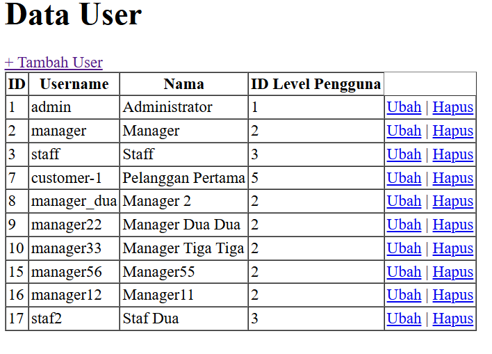

**Mata Kuliah: Pemrograman Web Lanjut (PWL)**  
**Program Studi: D4 - Teknik Informatika**  
**Semester: 4**  

---

**Kelas: TI 2A**  
**NIM: 2341720234**  
**Nama: Anya Callissta Chriswantari**  
**Jobsheet Ke-: 4**  

---

## Praktikum 1 - $fillable
#### LANGKAH 3

###### Gambar 1. Output localhost/WebLanjut/PWL_POS/public/user
> $fillable digunakan untuk memasukkan nilai ke dalam kolom level_id, username, nama, dan password ketika menggunakan metode create(), sehingga ketika link dijalankan data pengguna baru dengan username manager_dua akan ditambahkan ke tabel data user.

#### LANGKAH 6

###### Gambar 2. Output localhost/WebLanjut/PWL_POS/public/user
> Error tersebut terjadi karena kolom 'password' pada $fillable dihapus sehingga ketika menambahkan data tidak bisa mengakses 'password'.

## Praktikum 2
### 2.1 - Retrieving Single Models
#### LANGKAH 3

###### Gambar 3. Output localhost/WebLanjut/PWL_POS/public/user
> $user = UserModel::find(1); digunakan untuk mencari data pengguna dengan id 1. Kemudian data akan ditampilkan oleh view yang menghasilkan tampilan tersebut.

#### LANGKAH 5

###### Gambar 4. Output localhost/WebLanjut/PWL_POS/public/user
> $user = UserModel::where('level_id', 1)->first(); digunakan untuk mencari data semua pengguna dengan level_id 1 dan diambil satu baris pertama. Kemudian data akan ditampilkan oleh view yang menghasilkan tampilan tersebut.

#### LANGKAH 7

###### Gambar 5. Output localhost/WebLanjut/PWL_POS/public/user
> firstWhere('level_id', 1) merupakan shortcut $user = UserModel::where('level_id', 1)->first(); digunakan untuk mencari data semua pengguna dengan level_id 1 dan diambil satu baris pertama. Kemudian data akan ditampilkan oleh view yang menghasilkan tampilan tersebut.

#### LANGKAH 9

###### Gambar 6. Output localhost/WebLanjut/PWL_POS/public/user
> $user = UserModel::findOr(1, ['username', 'nama'], function() {
    abort(404);
}); digunakan untuk mencari data dengan id 1 serta mengembalikan kolom username dan nama, jika data tidak ditemukan akan menjalankan callback function yang menampilkan halaman eror 404. Karena data dengan id 1 ditemukan maka akan ditampilkan oleh view yang menghasilkan tampilan tersebut.

#### LANGKAH 11

###### Gambar 7. Output localhost/WebLanjut/PWL_POS/public/user
> $user = UserModel::findOr(20, ['username', 'nama'], function() {
    abort(404);
}); digunakan untuk mencari data dengan id 20 serta mengembalikan kolom username dan nama, jika data tidak ditemukan akan menjalankan callback function yang menampilkan halaman eror 404. Karena data dengan id 20 tidak ditemukan maka ditampilkan halaman error tersebut.

### 2.2 - Not Found Exceptions
#### LANGKAH 2

###### Gambar 8. Output localhost/WebLanjut/PWL_POS/public/user
> $user = UserModel::findOrFail(1); digunakan untuk mencari data pengguna dengan id 1. Jika data ditemukan akan dikembalikan sebagai objek, jika tidak diatmpilkan error 404. Karena data dengan id 1 ditemukan maka akan ditampilkan oleh view yang menghasilkan tampilan tersebut.

#### LANGKAH 4

###### Gambar 9. Output localhost/WebLanjut/PWL_POS/public/user
> $user = UserModel::where('username', 'manager9')->firstOrFail(); digunakan untuk mencari pengguna dengan username "manager9" dan mengambil satu data pertama yang ditemukan. Jika ditemukan ditampilkan sebagai objek, jika tidak ditampilkan error 404. Karena data dengan username "manager9" tidak ditemukan maka ditampilkan halaman error tersebut.

### 2.3 - Retreiving Aggregrates
#### LANGKAH 2

###### Gambar 10. Output localhost/WebLanjut/PWL_POS/public/user
> $user = UserModel::where('level_id', 2)->count(); digunakan untuk mencari dan menghitung jumlah pengguna dengan level_id 2. dd($user); digunakan untuk menampilkan isi variabel dan menghentikan eksekusi program. Output tersebut dihasilkan karena pemanggilan fungsi dd() sehingga ditampilkan baris letak fungsi tersebut.

#### LANGKAH 3

###### Gambar 11. Output localhost/WebLanjut/PWL_POS/public/user
> Setelah fungsi dd() dihilangkan dan dilakukan modifikasi pada view, akan ditampilkan output tersebut yang menunjukkan jumlah pengguna dengan level_id 2.

### 2.4 - Retreiving or Creating Models
#### LANGKAH 3

###### Gambar 12. Output localhost/WebLanjut/PWL_POS/public/user
> Kode tersebut akan mencari data pertama user dengan username "manager" dan nama "Manager". Jika ditemukan data akan dikembalikan, jika tidak akan dibuat data baru. Kemudian view akan dipanggil dan menampilkan tampilan tersebut.

#### LANGKAH 5

###### Gambar 13. Output localhost/WebLanjut/PWL_POS/public/user
> Kode tersebut akan mencari data berdasarkan kolom-kolom yang disebutkan. Jika ditemukan data akan dikembalikan, jika tidak akan dibuat data baru. Kemudian view akan dipanggil dan menampilkan tampilan tersebut.

###### Gambar 14. Tabel m_user pada database pwl_pos_
> Setelah dilakukan eksekusi kode, dapat dilihat pada database berhasil ditambahkan data tersebut.

#### LANGKAH 7

###### Gambar 15. Output localhost/WebLanjut/PWL_POS/public/user
> Kode tersebut akan mencari data pertama user dengan username "manager" dan nama "Manager". Jika ditemukan data akan dikembalikan, jika tidak akan dibuat data baru namun tidak langsung disimpan ke database. Karena data sudah ada maka view akan menampilkan tampilan tersebut.

#### LANGKAH 9

###### Gambar 16. Output localhost/WebLanjut/PWL_POS/public/user
> Kode tersebut akan mencari data pertama user dengan username "manager33" dan seterusnya. Jika ditemukan data akan dikembalikan, jika tidak akan dibuat data baru namun tidak langsung disimpan ke database. Karena data belum ada, akan dibuat data baru namun belum tersimpan di database sehingga pada tampilan tersebut data belum memiliki id yang akan otomatis dimiliki setelah ditambahkan pada database.

###### Gambar 17. Tabel m_user pada database pwl_pos_
> Pada database dapat dilihat jika data "manager33" belum ditambahkan.

#### LANGKAH 11

###### Gambar 18. Output localhost/WebLanjut/PWL_POS/public/user
> Pada langkah ini ditambahkan $user-save() untuk menyimpan perubahan data ke database. 

###### Gambar 19. Tabel m_user pada database pwl_pos_
> Pada database dapat dilihat jika data "manager33" berhasil ditambahkan.

### 2.5 - Attribute Changes
#### LANGKAH 2

###### Gambar 20. Output localhost/WebLanjut/PWL_POS/public/user
> Kode digunakan untuk membuat user baru, mengubah username, mengecek perubahan dengan isDirty() dan isClean(), lalu menyimpan perubahan dengan save(). Kemudian dd($user->isDirty()); akan mencetak false, karena tidak ada perubahan setelah save().

#### LANGKAH 4

###### Gambar 21. Output localhost/WebLanjut/PWL_POS/public/user
> Kode digunakan untuk membuat user baru, mengubah username, menyimpannya, lalu menggunakan wasChanged() untuk memeriksa perubahan. Kemudian dd($user->wasChanged(['nama', 'username'])); akan mencetak true, karena username berubah.

### 2.6 - Create, Read, Update, Delete (CRUD)
#### LANGKAH 3

###### Gambar 21. Output localhost/WebLanjut/PWL_POS/public/user
> UserModel::all() mengambil semua data user dan mengirimkan ke view dalam bentuk array. Kemudian view akan menampilkan semua data user menggunakan @foreach seperti tampilan tersebut.

#### LANGKAH 7

###### Gambar 22. Output localhost/WebLanjut/PWL_POS/public/user
> Pada langkah ini ditambahkan kode untuk melakukan creat berupa menambahkan user. Ketika "+Tambah User" diklik akan ditampilkan form tersebut. Namun belum dapat dilakukan penambahan user karena belum terdapat method HTTP POST untuk mengirimkan data inputan.

#### LANGKAH 11

###### Gambar 23. Output localhost/WebLanjut/PWL_POS/public/user
> Pada langkah ini ditambahkan kode untuk menyimpan inputan dari penambahan user menggunakan method HTTP POST pada route. Dapat dilihat pada tampilan tersebut terdapat data staf2 yang berhasil ditambahkan melalui form CRUD.

#### LANGKAH 14

###### Gambar 24. Output localhost/WebLanjut/PWL_POS/public/user
> Pada langkah ini ditambahkan kode untuk update berupa mengedit data user. Ketika "Ubah" pada salah satu data diklik akan muncul form tersebut. Namun belum dapat dilakukan penyimpanan karena belum terdapat method HTTP PUT untuk mengupdate data.

#### LANGKAH 17

###### Gambar 25. Output localhost/WebLanjut/PWL_POS/public/user
> Pada langkah ini ditambahkan kode untuk menyimpan perubahan data menggunakan method HTTP PUT pada route. Dapat dilihat pada tampilan tersebut username staf3 berhasil diubah menjadi staf33.

#### LANGKAH 20

###### Gambar 26. Output localhost/WebLanjut/PWL_POS/public/user
> Pada langkah ini ditambahkan kode untuk delete berupa menghapus data. Setelah "Hapus" pada salah satu data diklik, data tersebut akan terhapus. Dapat dilihat data staf33 sudah terhapus dari tabel.

### 2.7 - Relationships
#### LANGKAH 3

###### Gambar 27. Output localhost/WebLanjut/PWL_POS/public/user
> belongsTo digunakan untuk membuat relasi antara UserModel dan LevelModel karena UserModel memiliki foreign key dari primary key yang dimiliki LevelModel yaitu level_id. with('level') digunakan untuk mengambil data user beserta levelnya dalam satu query. dd($user) digunakan untuk menampilkan isi $user yang kemudian ditampilkan oleh view seperti tampilan tersebut.

#### LANGKAH 6

###### Gambar 28. Output localhost/WebLanjut/PWL_POS/public/user
> Pada langkah ini dilakukan penambahan kode pada view berupa penambahan kolom "Kode Level" dan "Nama Level".